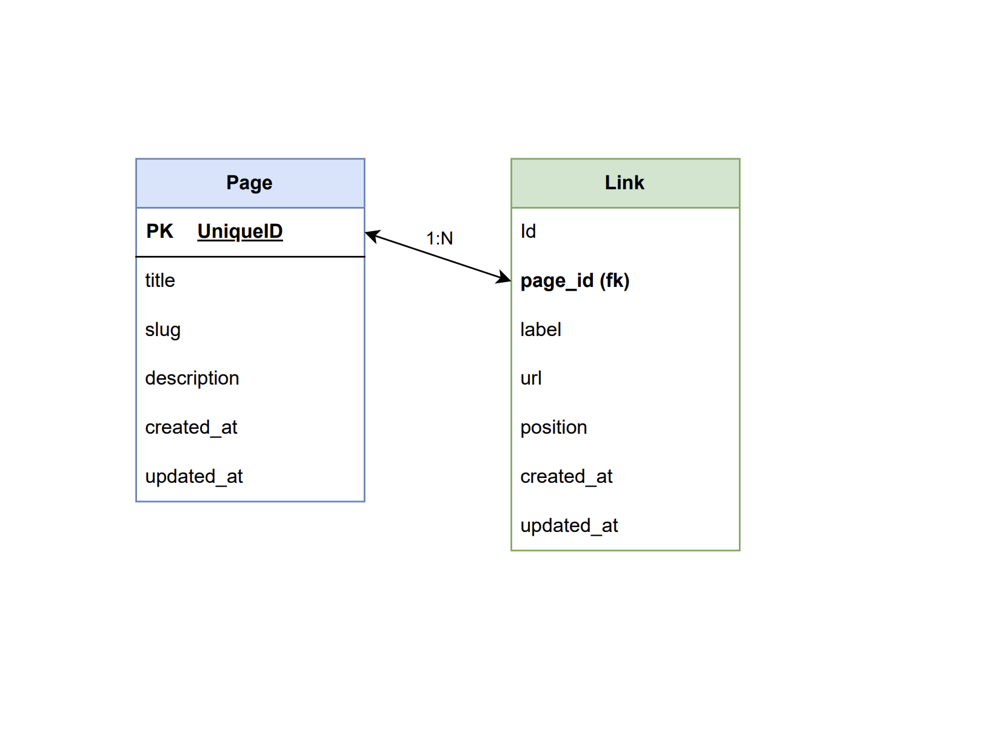

# Linktree Clone Project (Spring Boot TDD Training)

This project is built using the Test-Driven Development (TDD) methodology to master Spring Boot.
It is part of my 2026 mission at Decathlon

## 🏗 Architecture & Database

Below is the relational schema designed for the MVP:

### Technical Details:
- **Migrations** : Managed via Flyway.
- **Relationships** : 1-N (One-to-Many) relationship between `Page` and `Link`

## 🚀 Git Methodology
The project follows the Red-Green-Refactor cycle. Key milestones are marked with **Git Tags**:
- `step-1-red` : Initial failing test (proving the test requirement).
- `step-2-green` : Minimal implementation to pass the test.
- `step-3-refactor` : Cleaned up and optimized final code.